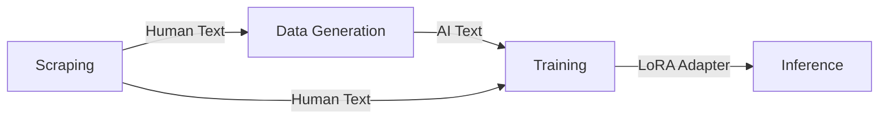

# System Architecture

The AI Writing Detector pipeline consists of four distinct stages, designed to create a high-quality dataset, train a robust classifier, and perform inference.

## 1. Scraping Layer
**Goal**: Acquire clean, high-probability human-written text.
- **Source**: Wikipedia.
- **Constraint**: Revisions strictly from **pre-2022**.
- **Reasoning**: To ensure the "human" text is not contaminated by LLMs (ChatGPT release date: Nov 2022).
- **Output**: `data/human_text_pre2022.jsonl`

## 2. Generation Layer
**Goal**: Create adversarial AI-generated text based on the human samples.
- **Model**: OpenAI GPT-5 Nano.
- **Technique**: **Summarize-Then-Expand**.
    1.  *Summarize*: Strip the human text of unique styling/artifacts.
    2.  *Expand*: Ask the AI to rewrite the summary into a full paragraph.
- **Output**: `data/ai_generated_text.jsonl`

## 3. Training Layer
**Goal**: Fine-tune a FLM (Foundational Language Model) to distinguish between the two classes.
- **Base Model**: `bert-base-cased` (Google's BERT).
- **Technique**: **LoRA (Low-Rank Adaptation)**.
    - Instead of retraining all 110M parameters, we train rank-decomposition matrices injected into the `query` and `value` attention layers.
    - Efficient and prevents catastrophic forgetting.
- **Balance**: 50/50 split between Human/AI data.
- **Output**: `training/src/results/final_model`

## 4. Inference Layer
**Goal**: Real-time classification.
- **Process**:
    1.  Load Base BERT model.
    2.  Load LoRA weights.
    3.  Tokenize input.
    4.  Output probability distribution (Softmax).
