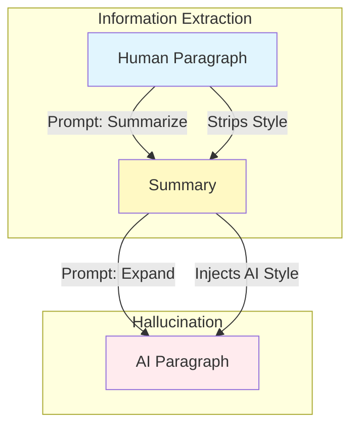

# AI Data Generation

To train a robust detector, we cannot simply use "random" AI text. We need text that is **semantically equivalent** to our human samples but **stylistically distinct** (AI-written). This forces the model to learn *style* rather than *topic*.

## The "Rewrite" Problem

If we simply ask an LLM to "rewrite this text", it often copies 90% of the words and just changes a few adjectives. This results in "human" text with a light "AI" coating, which confuses the classifier.

## The Solution: Information Bottleneck

We use a **Summarize-Then-Expand** pipeline to force a complete structural rewrite while preserving meaning.

### Step 1: Condense (Information Extraction)
We ask the LLM (GPT-5 Nano) to summarize the human paragraph into 1-2 sentences.
> *Prompt*: "Summarize this paragraph... retain important context... 2 sentences max."

This strips away sentence structure, word choice, and cadence, leaving only the raw facts.

### Step 2: Expand (Hallucination)
We then ask the LLM to write a *new* paragraph based *only* on that summary.
> *Prompt*: "Please expand this summarized text... write a paragraph..."

This performs a **Structural Reset**. The LLM must generate new sentences, new flow, and new vocabulary to fill the void. The result is pure "AI Slop" — structurally perfect, somewhat generic, and statistically distinct from the original human text.

## Robustness
The script `data-generation/main.py` handles this utilizing OpenAI's API, processing the `human_text_pre2022.jsonl` file and outputting `ai_generated_text.jsonl`.
