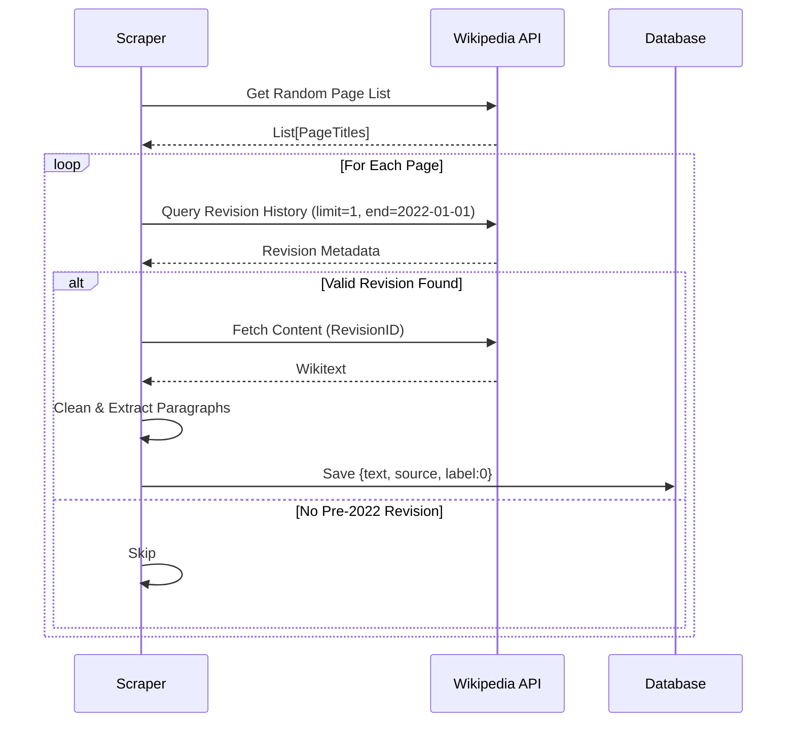

# Data Scraping Strategy

The reliability of a binary classifier depends entirely on the purity of its "negative" class (Human Text). If our human text contains AI-generated content (e.g., recent Wikipedia edits made by bots/LLMs), the model will fail to learn the decision boundary.

## The Pre-2022 Constraint

The core mechanic of our scraper is the **Time-Travel Filter**.

1.  **Target**: Random Wikipedia Articles.
2.  **API**: Wikimedia REST API.
3.  **Filter**:
    - We do *not* fetch the current version of a page.
    - We specifically request the revision history.
    - We select the latest revision that strictly predates **January 1st, 2022**.

### Why 2022?
ChatGPT was released in **November 2022**. By strictly cutting off data before this date, we guarantee (to a high degree of certainty) that the text is human-written.



## Implementation Details

The scraper (`scraping/src/main.py`):
1.  Fetches a random list of articles.
2.  Iterates through them, querying the revision API.
3.  Extracts the raw wikitext of the qualified revision.
4.  Cleans the text (removes refs, tables, formatting).
5.  Saves to JSONL format:
    ```json
    {"text": "Extracted paragraph...", "source": "Title of Page"}
    ```
